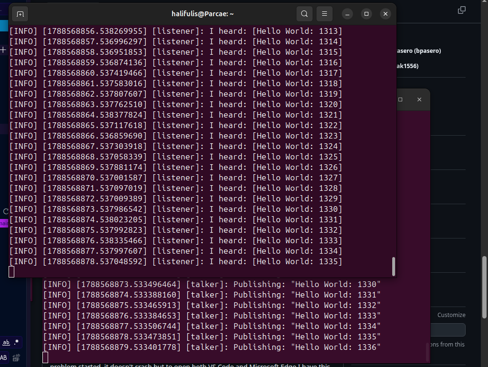

# Inspection record

Replace every bracketed prompt with your own observation. Keep output excerpts short.

## Part 1: First observation

**What appears to be happening?**  
`ros2 run demo_nodes_py talker` seems to output a "Hello World" every second, with the count of how many messages it has sent so far being put next to it.

`ros2 run demo_nodes_py listener` seems to listen and copies, and outputs the message the Talker is publishing.

Notably, it seems the actual Message the Talker is publishing is specifically the Hello World message (*see the observation for more detail*). This is because the overlapping message aside from the informational block is simply the "Hello World: X" message for both Listener and Talker.

**What did you observe that supports this?**  
On the Talker terminal, it outputs `Publishing: "Hello World: X"`, where X is an always ascending number corresponding to the number of messages so far (i.e. the count published messages so far).

On the Listener terminal, it outputs `I heard: [Hello World: X]`, wherein the latest message with X corresponds to the latest Talker's X.

On both terminals, it also outputs a preceding informational message to the above formatted as `[INFO] [NNNNNNNNNN.MMMMMMMMM] [type]`, wherein the sequence of Ns is the same for both, the sequence of Ms is roughly close but always different, and `type` being replaced by `talker` and `listener` respectively.

See the following image for better clarification.



## Part 2: Standard demo

### Running nodes

NOTE: I am interpreting "record short, relevant excerpts" as NOT the entire terminal, but the specific exact output of each command, cutting out and/or compressing details not discussed in the Interpretation section.

NOTE #2: Additionally, I'm going to interpret each topic section following thereafter to roughly match multiple commands as per the implication of the assignment.

NOTE #3: I also converted the `text` format to `bash` for commands, so it looks nice :D

NOTE #4: I am also assuming the intention is for a hands-on experience, and presumably this means some implicit degree of not looking stuff up, which I will do my best NOT to.

NOTE #5: With regards to the use of "..." in the logs, they are specifically to hide mass outputs of lines, and are NOT actual outputs of the code.

**Commands:**
NOTE: this was modified to include both "node" commands intentionally.

```bash
ros2 node list
ros2 node info /talker
```

```text
halifulis@Parcae:~$ ros2 node list
/listener
/talker

halifulis@Parcae:~$ ros2 node info/talker
Subscribers:

Publishers:
/chatter: std_msgs/msg/String
... 2 more lines ...
Service Servers:
/talker/describe_parameters: rcl_interfaces/srv/DescribeParameters
... 6 more lines ...

Service Clients:

Action Servers:

Action Clients:

```

**Interpretation:** [What does this tell you?]
`ros2 node list` appears to list all nodes that exist in the environment. The implication of the use of `\` implies that nodes can be nested within one another. Though this is largely unconfirmed by the output given the current "flat" environment.

`ros2 node info /talker` appears to output the interfaces of a node grouped by their type. This is largely implied by the constant reappearance of `rcl_interfaces` across almost all of the information that exists there in similar form as by the `/talker/describe_parameters` listed above.

Additionally, `/chatter` in the `Publishers` section seems to be the Topic that Talker is publishing too. This is corroborated by the fact `/chatter` appears in the Subscriber interfaces of Listener in a separate command not listed above. Similarly, the other lines like `/parameter_events` and `/rosout` also appear to be Topics themselves for the same reasoning.

The interfaces `/parameter_events` and `/rosout` seem to exist in the Publisher section of both Talker and Listener. Their names and shared existence implies this is something that exists in all nodes that can be subscribed to, though the only thing that can be definitively concluded is that they exist in both.

Furthermore, `/talker/describe_parameters` along with a similar copy in Listeners with the appropriate `/listener` prefix to `/describe_parameters` exists. Similar parameters with the `rcl_interfaces` across the `:`, which might mean its being published to some common standard internal output? Considering `/rosout` exists across all nodes as a Publisher, this implies that this is the Topic its being outputted to by standard of some rudimentary operation and/or function in ROS2 (rcl = ros command log?).

Finally, there also exists empty Service Clients, Action Servers, and Action Clients sections. Subscribers is also empty in Talker specifically, though this might just mean Talker is not listening/subscribing to any particular Topic. Regardless, the three totally empty sections could just imply that neither Talker nor Listener are themselves a Service that provides anything to a client but use a Service themselves from some other part of the overall architecture given the non-emptiness of Service Servers. Additionally, no "Actions" are being performed or received either as denoted by its appropriately empty sections.

### Connections and message type

**Commands:**

```bash
ros2 topic list -t
ros2 topic info /chatter
ros2 interface show std_msgs/msg/String
```

```text
halifulis@Parcae:~$ ros2 topic list -t
/chatter [std_msgs/msg/String]
/parameter_events [rcl_interfaces/msg/ParameterEvent]
/rosout [rcl_interfaces/msg/Log]

halifulis@Parcae:~$ ros2 topic info /chatter
Type: std_msgs/msg/String
Publisher count: 1
Subscription count: 1

halifulis@Parcae:~$ ros2 interface show std_msgs/msg/String
# This was originally provided as an example message.
# It is deprecated as of Foxy
# It is recommended to create your own semantically meaningful message.
# However if you would like to continue using this please use the equivalent in example_msgs.

string data
```

**Interpretation:** [Identify the publisher, subscriber, topic, and message structure.]
Assuming the above is asking to identify the SPECIFIC relevant Publisher, Subscriber, and Topics pertaining to the output and the specific environment produced by the assignment so far... AND assuming "Publisher" and "Subscriber" refer to the nodes containing them...

There are Three topics: Chatter, Parameter_Events, and Rosout. All nodes so far are appear to be Publishers (or contain them?) to Parameter_Events and Rosout. Talker specifically appears to be a Publisher to Chatter, while Listener appears to be a Subscriber to Chatter. Additionally, it seems messages can be structured rather freely considering the variety across the three topics (String, ParameterEvent, Lod). With that in mind and given the application of ROS2 (sending rich data for robots to use), `string data` seems to correspond to `data_type name`, and messages are structured therefore as a collection of accessible fields (though this might be a stretch). In this particular case, the messages being sent across the current existing nodes (Talker and Listener) are probably just straight Strings. However, implication of the structure of messages as a collection fields seems to be corroborated by the following commands in the next section with its display of `data`.

### Message and rate

**Commands:**

```bash
ros2 topic echo /chatter --cone
ros2 topic hz /chatter
```

```text
halifulis@Parcae:~$ ros2 topic echo /chatter --once
data: 'Hello World: 18992'
---
halifulis@Parcae:~$ ros2 topic hz /chatter
average rate: 1.000
	min: 1.000s max: 1.000s std dev: 0.00009s window: 3
average rate: 1.000
	min: 1.000s max: 1.000s std dev: 0.00014s window: 4
average rate: 1.000
	min: 1.000s max: 1.000s std dev: 0.00015s window: 5
... 20 lines ...
average rate: 1.000
	min: 0.998s max: 1.002s std dev: 0.00051s window: 26
^Chalifulis@Parcae:~$ 
```

**Interpretation:** [Describe one message and the approximate rate.]
The "Hello World" message being outputted by Talker appears to be going at exactly once a second or 1HZ. The third `std dev` value appears to be the standard deviation of the overall statistic, which is ridiculously small. Window seems to be the "window" or number of messages used to calculate said statistics.

## Part 4: Your status system

### Nodes and topic

**Commands and relevant output:**

```bash
halifulis@Parcae:~/pinto-cpe491-a0$ ros2 node list
/status_monitor
/status_publisher
halifulis@Parcae:~/pinto-cpe491-a0$ ros2 node info /status_publisher
/status_publisher
  Subscribers:

  Publishers:
    /lab0/status: std_msgs/msg/String
    /parameter_events: rcl_interfaces/msg/ParameterEvent
    /rosout: rcl_interfaces/msg/Log
  Service Servers:
    /status_publisher/describe_parameters: rcl_interfaces/srv/DescribeParameters
    /status_publisher/get_parameter_types: rcl_interfaces/srv/GetParameterTypes
    /status_publisher/get_parameters: rcl_interfaces/srv/GetParameters
    /status_publisher/get_type_description: type_description_interfaces/srv/GetTypeDescription
    /status_publisher/list_parameters: rcl_interfaces/srv/ListParameters
    /status_publisher/set_parameters: rcl_interfaces/srv/SetParameters
    /status_publisher/set_parameters_atomically: rcl_interfaces/srv/SetParametersAtomically
  Service Clients:

  Action Servers:

  Action Clients:

halifulis@Parcae:~/pinto-cpe491-a0$ ros2 node info /status_monitor
/status_monitor
  Subscribers:
    /lab0/status: std_msgs/msg/String
  Publishers:
    /parameter_events: rcl_interfaces/msg/ParameterEvent
    /rosout: rcl_interfaces/msg/Log
  Service Servers:
    /status_monitor/describe_parameters: rcl_interfaces/srv/DescribeParameters
    /status_monitor/get_parameter_types: rcl_interfaces/srv/GetParameterTypes
    /status_monitor/get_parameters: rcl_interfaces/srv/GetParameters
    /status_monitor/get_type_description: type_description_interfaces/srv/GetTypeDescription
    /status_monitor/list_parameters: rcl_interfaces/srv/ListParameters
    /status_monitor/set_parameters: rcl_interfaces/srv/SetParameters
    /status_monitor/set_parameters_atomically: rcl_interfaces/srv/SetParametersAtomically
  Service Clients:

  Action Servers:

  Action Clients:
  
halifulis@Parcae:~/pinto-cpe491-a0$ ros2 topic list -t
/lab0/status [std_msgs/msg/String]
/parameter_events [rcl_interfaces/msg/ParameterEvent]
/rosout [rcl_interfaces/msg/Log]
halifulis@Parcae:~/pinto-cpe491-a0$ ros2 topic info /lab0/status
Type: std_msgs/msg/String
Publisher count: 1
Subscription count: 1
```

**Interpretation:** [Explain how this supports the required node names, topic, type, publisher, and subscriber.]

### Message and Rate

**Commands and relevant output:**

```bash
halifulis@Parcae:~/pinto-cpe491-a0$ ros2 topic echo /lab0/status --once
data: 'System Ready: 6879'
halifulis@Parcae:~/pinto-cpe491-a0$ ros2 topic hz /lab0/status
average rate: 4.001
        min: 0.250s max: 0.250s std dev: 0.00009s window: 6
average rate: 4.000
        min: 0.250s max: 0.250s std dev: 0.00009s window: 10
average rate: 4.000
        min: 0.250s max: 0.250s std dev: 0.00012s window: 15
average rate: 4.000
        min: 0.250s max: 0.250s std dev: 0.00011s window: 20
... ??? more lines ...
average rate: 4.000
        min: 0.249s max: 0.251s std dev: 0.00012s window: 268
average rate: 4.000
        min: 0.249s max: 0.251s std dev: 0.00012s window: 273
^Chalifulis@Parcae:~/pinto-cpe491-a0$ ^C
```

**Interpretation:** [Explain how this supports the required message content and 4 Hz rate.]

## Part 6: Your count system

**Commands and relevant output:**

```text
halifulis@Parcae:~/pinto-cpe491-a0$ ros2 node list
/count_monitor
/count_publisher
halifulis@Parcae:~/pinto-cpe491-a0$ ros2 node info /count_publisher
/count_publisher
  Subscribers:

  Publishers:
    /lab0/count: std_msgs/msg/Int32
    /parameter_events: rcl_interfaces/msg/ParameterEvent
    /rosout: rcl_interfaces/msg/Log
  Service Servers:
    /count_publisher/describe_parameters: rcl_interfaces/srv/DescribeParameters
    /count_publisher/get_parameter_types: rcl_interfaces/srv/GetParameterTypes
    /count_publisher/get_parameters: rcl_interfaces/srv/GetParameters
    /count_publisher/get_type_description: type_description_interfaces/srv/GetTypeDescription
    /count_publisher/list_parameters: rcl_interfaces/srv/ListParameters
    /count_publisher/set_parameters: rcl_interfaces/srv/SetParameters
    /count_publisher/set_parameters_atomically: rcl_interfaces/srv/SetParametersAtomically
  Service Clients:

  Action Servers:

  Action Clients:

halifulis@Parcae:~/pinto-cpe491-a0$ ros2 node info /count_monitor
/count_monitor
  Subscribers:
    /lab0/count: std_msgs/msg/Int32
  Publishers:
    /parameter_events: rcl_interfaces/msg/ParameterEvent
    /rosout: rcl_interfaces/msg/Log
  Service Servers:
    /count_monitor/describe_parameters: rcl_interfaces/srv/DescribeParameters
    /count_monitor/get_parameter_types: rcl_interfaces/srv/GetParameterTypes
    /count_monitor/get_parameters: rcl_interfaces/srv/GetParameters
    /count_monitor/get_type_description: type_description_interfaces/srv/GetTypeDescription
    /count_monitor/list_parameters: rcl_interfaces/srv/ListParameters
    /count_monitor/set_parameters: rcl_interfaces/srv/SetParameters
    /count_monitor/set_parameters_atomically: rcl_interfaces/srv/SetParametersAtomically
  Service Clients:

  Action Servers:

  Action Clients:

halifulis@Parcae:~/pinto-cpe491-a0$ ros2 topic list -t
/lab0/count [std_msgs/msg/Int32]
/parameter_events [rcl_interfaces/msg/ParameterEvent]
/rosout [rcl_interfaces/msg/Log]
halifulis@Parcae:~/pinto-cpe491-a0$ ros2 topic echo /lab0/count --once
data: 221
---
halifulis@Parcae:~/pinto-cpe491-a0$ ros2 topic hz /lab0/count
average rate: 1.000
        min: 1.000s max: 1.000s std dev: 0.00000s window: 2
average rate: 1.000
        min: 1.000s max: 1.000s std dev: 0.00005s window: 4
average rate: 1.000
        min: 1.000s max: 1.000s std dev: 0.00008s window: 6
average rate: 1.000
        min: 1.000s max: 1.000s std dev: 0.00007s window: 8
average rate: 1.000
        min: 1.000s max: 1.000s std dev: 0.00008s window: 10
... ??? more lines ...
        min: 1.000s max: 1.001s std dev: 0.00014s window: 48
average rate: 1.000
        min: 1.000s max: 1.001s std dev: 0.00014s window: 50
average rate: 1.000
        min: 1.000s max: 1.001s std dev: 0.00014s window: 52
^Chalifulis@Parcae:~/pinto-cpe491-a0$ 
```

**Interpretation:** [Explain how this supports the node names, /lab0/count topic, Int32 type, publisher/subscriber connection, increasing values, and 1 Hz rate.]

NOTE: Needed to run `chmod +x tests/check_assignment.py` to give it permission to run.
NOTE #2: While the assignment says to follow the instructions/tutorial and the associated source files for the minimal publishers and subscribers, the assignment on WebCampus and the README.md contain slightly different information. Namely, the overall folder structure is specified in the README.md but not the WebCampus. Unsure as to which one precisely to follow, I made the judgement that the intention was for the README.md structure to be followed as  `check_assignment.py`'s seems to also corroborate that conclusion. In addition to that, I have removed the `src` folder and associated package obtained from the tutorial linked to better match the folder structure. It would be appreciated that such specifications be made and put in *writing* next time.
